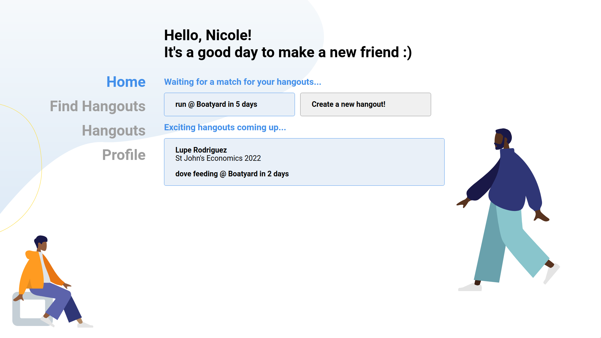
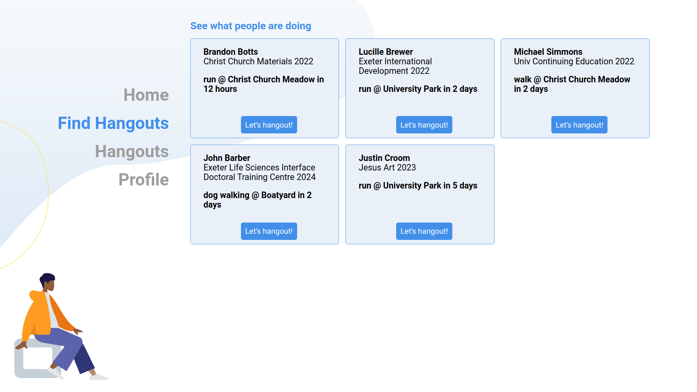
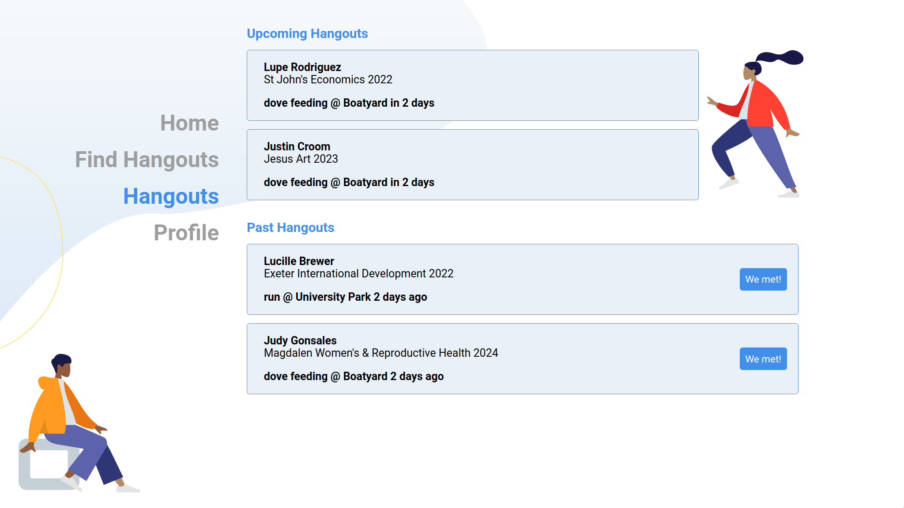
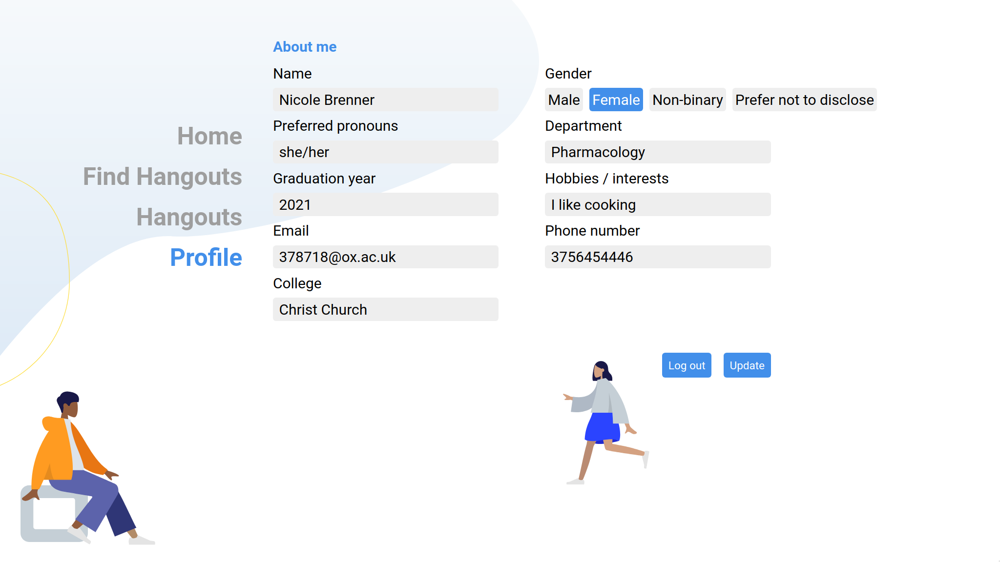

# [Oxfordhack 2020] Find A Mate

## Inspiration

Empty town, quiet streets, scattered leaves. Dark night, incandescent lamp, virtual libraries. Perplexed, listless, drown by CS sheets, you know that’s not how uni life is supposed to be. But it’s the reality, the cold, brutal, overpromising, and underdelivered reality that epitomizes this year’s online activities. 
 
Though fresh on campus, you have no one to walk with, to chat with, to explore life with. Until now. We find you one.
 
Looking for a literature master to discuss your favourite poem but all your household is engineering geeks? Waiting for a random soul to listen to the sadness and anxieties you’ve been trying to hide for 3 years? Desperate to hypnotize your crush but couldn’t find the psychologist to instruct you? We find you one!

(also... we are three first-years and one visiting student, and we want to meet new friends!)

## What it does

Our application helps Oxford students initiate and participate in paired hangouts during the pandemic by matching people. Don't worry - two people are allowed to hang out during the lockdown (socially-distanced, outdoors, and with a mask of course)! 
 
1. Users can sign up for their own account and enter their profile information (subject, Oxford email, pronouns, hobbies, etc.), which can be edited later. 
 
2. When User A posts a hangout on the website, the website will display this hangout in the feeds of other users. Users can also restrict people based on gender, college, subject, and year. Note that the event will not be shown to users whose information doesn’t match the type specified by User A. 
 
3. Once User B clicks “Let’s hangout!” to indicate that they’d like to participate in this hangout, then this hangout will now match the two users and this confirmed hangout will show up in their profiles. The contact information of both users will be available to each other, and now it's up in their hands! Unless User A changes their plan and cancels the hangout, their hangout is confirmed. Deleted hangouts will not be shown to others again. 
 
4. The user's homepage shows upcoming hangouts and the hangouts created by the user. The user can also delete any hangout that the user created before it takes place, and this particular hangout will no longer be shown to others. 
 
5. Confirmed hangouts will enter a separate database, enabling users to navigate the past hangouts they involved in and allowing the app to keep track of the hangouts going on at a specific time and location. 

## How I built it

### Frontend

Using *Figma*, we designed *UI logic, layout, fonts, colours, and styles*. We then built UI with *Html, CSS, javascript, and Vue*. 

Through *Google Cloud*, we deployed the *web pages onto a website*, which is then directed to our *domain*. 

To evaluate the *frontend functionality and backend capacity*, we generated virtual users and hangouts, uploaded them into our database, and tested our app using these simulated data. 

### Backend

After building the database with *SQLAlchemy*, we developed the logic, algorithms on our database and realized basic functions (e.g. queries, add, remove), using python packages *flask and request*.

To establish the hangout-matching algorithm, the core functionality of our app, we constructed a recommendation system with randomized algorithms and queue data structure to select and display hangout feeds to users. This hangout-matching algorithm allows users to find hangouts aligning with the criteria set by the publisher, who may want to meet people of a certain type (e.g. fresh, similar) by specifying the hangout criteria accordingly. 

(Should we also briefly introduce that the user-matching algo (private hangouts) is also under development?)

### Front-Back Interaction

Using **javascript*, we connected the UI to backend functions and the database, allowing us to update the database in accordance with front-end activities (posting hangouts, updating bio, refreshing feeds, etc.)*

After authenticating the user in Log in, here is a breakdown of the screens and functions: 
* Home 
	* The user can see hangouts they’ve initiated, and create a new hangout 
* Find hangouts
	* the user sees their main feed, which are hangouts that others have initiated and the user fits their requirements
* Hangouts
	* the user can view a list of upcoming hangouts and past hangouts
* Profile 
	* keeps track of the user’s personal information. They can also update their information or log out

## Challenges I ran into

This is the first time Zi is using vue, and she struggled with & learned a lot about reusing components, passing data between screens, and connecting with the backend. 

Ziyang Zhang (Edward): 
Teams were working remotely this year so we can’t give our teammates real-time updates and feedbacks, which could cause redundant work. Immediately after brainstorming, Xingjian and I started to work on the database and Alan worked on backend. Unfortunately, during the next meeting, we discovered that most of our work is overlapped and unnecessary. What’s worse, the difference between glossary/terms made these two modules hard to interact with each other. A team could be less than the sum of its parts, if teammates don’t keep track of what each person is doing.  

## Accomplishments that I'm proud of

Zi is super proud of her teammates for putting together a complete product with the frontend and backend that we built. Also - the team dynamic was very enjoyable! 

Ziyang Zhang (Edward): 
Moving back and forth across the border of my comfort zone! I am the only one in my team who comes from a pure maths background. In this hackathon I employed my strength in abstract thinking to help my teammates design some data structures and APIs. But at the same time, I tried something entirely new and out of my comfort zone: media and communication. Yes, organizing ideas in a creative style and editing videos turned out very hard for pure mathematicians. Looking back, however, trying something entirely new and the process of pushing my limit proved very rewarding. That’s the Hackathon spirit I’m proud of!

## What I learned

Zi learned so much more about how to use Vue as a framework, and how it’s so important to plan out the initial functions and data models so that the frontend and backend can communicate smoothly. 
 
Collaboration and communication as a team proved essential. In programming classes, the task is usually individual. But in this hackathon we divided the task and each member specialized into what each member is good at: brainstorming, programming, architecture, UI design, and presentation. Initially our team did redundant work, disagreed on the best approach to the problem, and different modules failed to work compatibly with each other. But by regularly checking for updates and going through extensive communication with teammates whenever we have a question about the project, we managed to work effectively as a tightly knit team where teammates have trust in each other. 

Xingjian enjoys all 36 hours of working passionately with the team on their novel project. He implemented the matching algorithm and the backend logic. He really learned many things from his teammates during this hackathon, and had lots of fun.

## What's next for Find a mate

We’re hoping to deploy this web app so that real Oxford students can use it! Since we have the frontend and backend made for specific users, we would love for people to sign up and perhaps meet some new friends during this time. 

We’re hoping to follow through with the hangouts, and ask the users to “compliment” their new friend. We’re hoping to encourage bonding through this positivity.

## Try it out
 
[find-a-mate.online](https://find-a-mate.online/)

[figma design](https://www.figma.com/file/4qA6v6DAWnM2ASRjddasDd/Find-a-Friend?node-id=0%3A1)